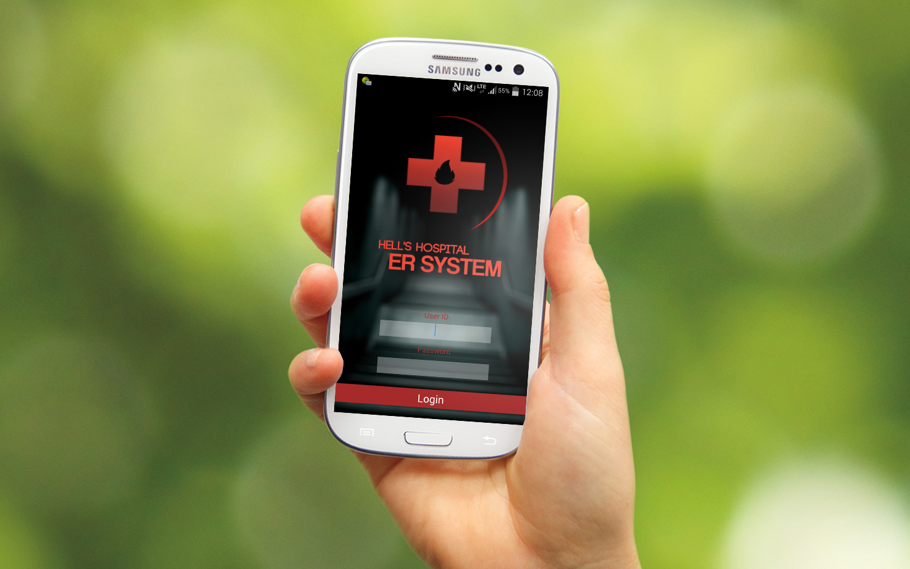

Hell-s-Hospital
===============

A simple application used in the emergency room of a hospital. The application will store all the patients' record based on the user's input, and all these information is capable of being reviewed or changed by the specific users.

All accounts are protected by username and password.

---------------

User can use the main menu to change or review the patient records.
